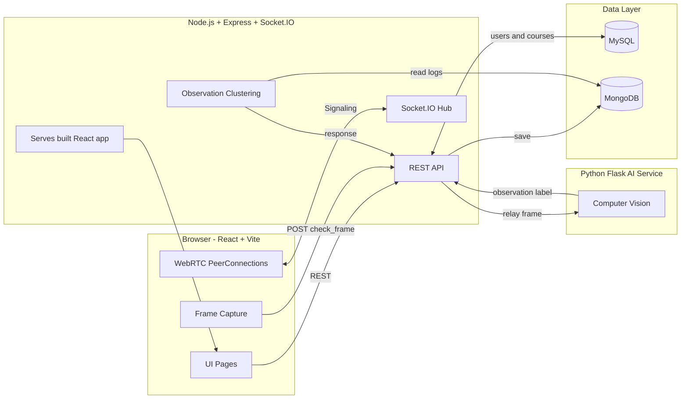
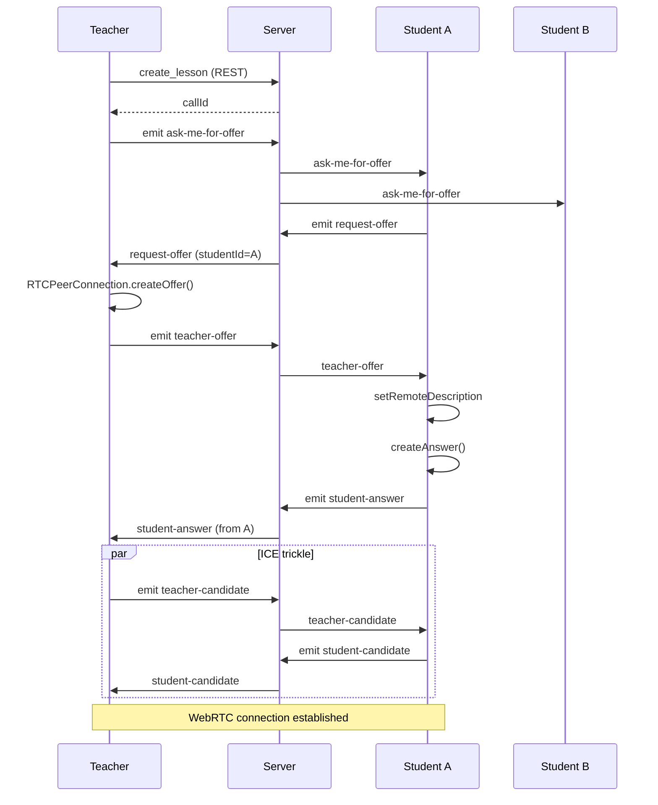
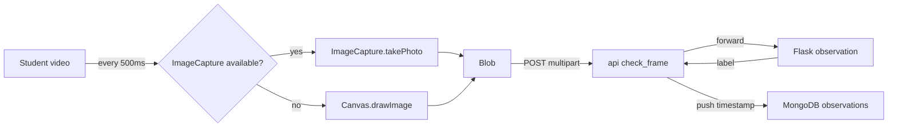
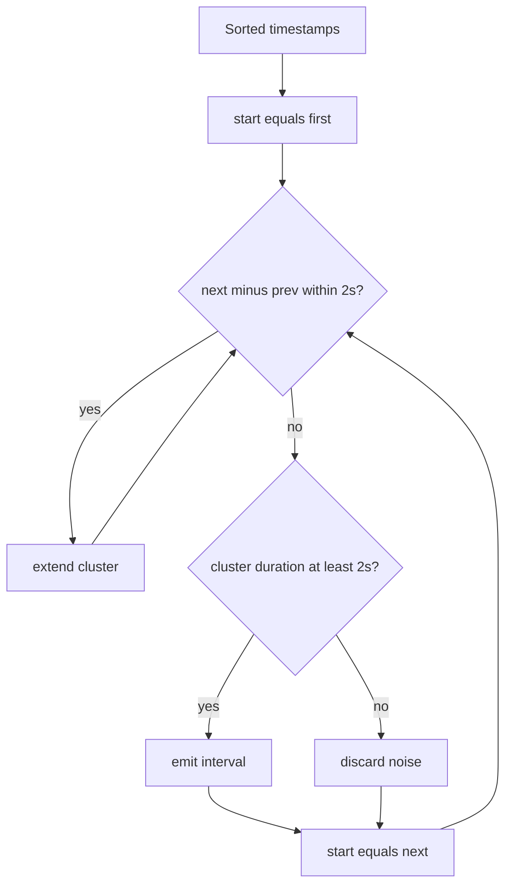

<div align="center">

# 🎓 Teach-Me

### A real-time e-learning platform with multi-peer video, AI-assisted student monitoring, and automated attendance reports.

**Built from scratch — no tutorials, no boilerplate, no shortcuts.**

[](https://react.dev)
[](https://nodejs.org)
[](https://webrtc.org)
[](https://socket.io)
[](https://mongodb.com)
[](https://mysql.com)
[](https://docker.com)

</div>

---

## 👋 Why you should look at this project

Most junior portfolios look the same: to-do apps, weather widgets, tutorial clones. **This one doesn't.**

Teach-Me is a complete real-time teaching platform I designed and built end-to-end. It includes:

- 🎥 **Multi-peer WebRTC video** — one teacher streams to many students, live, peer-to-peer. No SFU, no third-party video SDK. I wrote the signaling, ICE negotiation, and connection management myself.
- 🤖 **AI observation pipeline** — the browser captures frames, the backend relays them to a Python service that detects attention state (attentive / phone / face missing / wrong person), and stores every observation with a timestamp.
- 📊 **Automated attendance reports** — an algorithm clusters thousands of raw timestamps into human-readable "the student was on their phone for 45 seconds" intervals. Plain English, computed from raw data.
- 💬 **Real-time chat** built on top of the same Socket.IO layer as the video signaling.
- 🗄️ **Two databases** doing different jobs — MySQL for relational data, MongoDB for live session state. Chosen deliberately, not by accident.
- 📦 **Dockerized** — `docker compose up` and it runs.

I built this because I wanted to prove to myself that I could. Every layer — the React UI, the Node backend, the WebRTC signaling, the observation algorithm, the database design — is mine.

**[📥 Try it locally in 3 commands →](#-run-it-in-60-seconds)**  
**[🎥 Watch the 2-minute demo →](https://1drv.ms/v/c/ca524006c0ac4fc8/ETmrB7oF_75PgMy_lPOCcLsBkOuhSDVU0okXV8RwZPg4vg?e=MIHYhl)**

---

## 📸 Screenshots

<table>
  <tr>
    <td width="50%">
      
      <p align="center"><b>Authentication</b> — signup with profile image, login, password recovery, email verification</p>
    </td>
    <td width="50%">
      
      <p align="center"><b>Course catalog</b> — search, filter, enroll, dark mode</p>
    </td>
  </tr>
  <tr>
    <td width="50%">
      
      <p align="center"><b>Course page</b> — weekly schedule, enrolled students, live lecture button</p>
    </td>
    <td width="50%">
      
      <p align="center"><b>Live lesson</b> — teacher streaming to multiple students via WebRTC, with chat and per-student status</p>
    </td>
  </tr>
  <tr>
    <td width="50%">
      
      <p align="center"><b>Reports</b> — attendance summary per lesson, per student, per day</p>
    </td>
    <td width="50%">
      
      <p align="center"><b>Report detail</b> — every observation the AI made, clustered into time intervals</p>
    </td>
  </tr>
</table>

> **Note:** drop your screenshots into a `docs/` folder at the project root — the README will pick them up automatically.

---

## 🏗 Architecture



**Design decisions I made deliberately:**

| Choice | Why |
|---|---|
| **Peer-to-peer WebRTC, no SFU** | Simpler to reason about; the teacher's browser is the source of truth. An SFU (LiveKit, mediasoup) would scale better but adds a whole new service to maintain. For a 1-to-many classroom, this is the right trade-off. |
| **MySQL for relational data** | Users, courses, enrollments — all naturally relational. Foreign keys enforce integrity. |
| **MongoDB for live session state** | A `Call` document grows unboundedly during a lesson (messages, logs, observations). Embedding it in a single document is faster than joins and matches the access pattern. |
| **AI service as optional** | The backend calls the AI service with a 5-second timeout. If it's down, the lesson continues with `attentive` as the default. **Nothing breaks.** |
| **Docker for orchestration** | Two databases + Node + Python is a lot of moving parts. One command brings everything up. |

---

## 🎥 Deep dive: How the live lesson works

### 1. Signaling (Socket.IO + WebRTC)

WebRTC can't find peers on its own — it needs a **signaling channel**. I built that channel on top of Socket.IO.



Each student gets their **own** `RTCPeerConnection` from the teacher — so the teacher's browser maintains N connections for N students. This is what makes it "multi-peer."

### 2. Frame capture → AI → observation

While the lesson runs, each student's browser captures a frame every `1/fps` seconds:



The backend is a **thin relay** — it does not process images. This keeps Node fast and lets me swap the AI model without touching the app.

The AI service returns one of five labels:

- `attentive` — student is paying attention
- `notAttentive` — looking away
- `usingPhone` — phone detected
- `noFace` — face not visible
- `facesDoNotMatch` — wrong person

### 3. The observation clustering algorithm

This is the part I'm proudest of. Raw data looks like this:

```json
{
  "title": "usingPhone",
  "occurrencesDates": [
    "2024-06-20T09:15:00.000Z",
    "2024-06-20T09:15:02.000Z",
    "2024-06-20T09:15:04.000Z",
    "2024-06-20T09:15:08.000Z",
    "2024-06-20T09:15:10.000Z"
  ]
}
```

**1,000 raw timestamps are useless to a teacher.** They need to see: *"at 9:15 AM, this student was on their phone for 45 seconds."*

So I wrote an algorithm that walks the timestamps and clusters them into **continuous intervals**:

- **Rule 1 — continuity:** the gap between consecutive timestamps must be **≤ 2 seconds**. A 3-second gap means the student put the phone away and picked it up again — that's a new interval.
- **Rule 2 — significance:** the total duration of a cluster must be **≥ 2 seconds**. This rules out single-frame noise (e.g. AI misclassifying one frame).



The output is a clean list of `{ from, to }` intervals per observation type, plus the total accumulated time. **This is the difference between a data dump and an actual report.**

### 4. Real-time chat

Chat reuses the same Socket.IO connection as the signaling. Messages are:

1. Emitted by the student with the `message` event
2. Persisted into `Call.messages[]` in MongoDB
3. Broadcast to the teacher and all other students in the call

The chat is **scoped to the call** — when a lesson ends, the message history is frozen with it.

---

## 🚀 Run it in 60 seconds

> **Prerequisites:** Docker Desktop is installed and running.

```bash
git clone https://github.com/sami000khaleel/teach-me.git
cd teach-me

cp .env.example .env          # then fill in GMAIL_APP_PASSWORD (optional)

docker compose up --build
```

That's it. Open **http://localhost:3000**.

The first build takes ~3 minutes (it compiles the React app and installs dependencies for Node). Subsequent starts are instant.

### Quick walkthrough to see it working

1. **Sign up as a teacher** → create a course
2. **Open an incognito window** → sign up as a student → enroll in that course
3. **As teacher:** click *Start Lecture* → click the camera icon
4. **As student:** click *Attend Lesson*
5. **Watch the magic:** the student's video appears on the teacher's screen, and vice versa
6. **Chat:** type a message as the student, see it appear on the teacher's side
7. **End the call**, then open *Reports* — you'll see the attendance record

> **Why incognito?** Browsers lock the camera to one tab at a time. Two tabs in the same browser will fail to establish WebRTC. Use two different browsers or an incognito window.

---

## 🛠 Tech Stack

| Layer | Technologies |
|---|---|
| **Frontend** | React 18, Vite, React Router v6, TailwindCSS, Socket.IO Client, Lucide Icons, react-datepicker |
| **Backend** | Node.js 20, Express, Socket.IO, Mongoose, mysql2/promise, Multer, Nodemailer, dotenv |
| **Real-time** | WebRTC (native), Socket.IO, REST |
| **Databases** | MySQL 8 (relational), MongoDB 7 (session state) |
| **AI (optional)** | Python 3.11, Flask, OpenCV, MediaPipe, face_recognition |
| **Infrastructure** | Docker, Docker Compose, multi-stage builds |

---

## 📂 Project layout

```
teach-me/
├── browser/                  React (Vite) frontend
│   ├── src/
│   │   ├── Components/       Reusable UI (Navbar, CourseForm, Reports, …)
│   │   ├── pages/            Route-level pages (Home, Room, Course, …)
│   │   ├── api/api.js        Axios API layer
│   │   └── main.jsx          Router + entry
│   └── package.json
│
├── server/                   Node.js backend
│   ├── config/db.js          MySQL connection pool
│   ├── controllers/          Route handlers (student, teacher)
│   ├── models/               MySQL queries + Mongoose schemas
│   ├── routes/               Express routers
│   ├── db/                   MySQL schema (auto-loaded by Docker)
│   ├── socketHandler.js      Socket.IO event handlers
│   └── index.js              Express + Socket.IO entry
│
├── flask_server/             (Optional) AI microservice
│   ├── server_flask_new_api.py
│   ├── requirements.txt
│   └── *.pkl                 Trained face-encoding model
│
├── Dockerfile                Multi-stage: frontend build + backend runtime
├── docker-compose.yml        MySQL + MongoDB + Server orchestration
├── .env.example              Environment template
└── README.md
```

---

## 🔌 REST API (highlights)

<details>
<summary><b>Student endpoints</b></summary>

| Method | Endpoint | Purpose |
|--------|----------|---------|
| `POST` | `/api/student/addstudent` | Register (multipart: data + image) |
| `GET`  | `/api/student/reinsert` | Login |
| `GET`  | `/api/student/get_courses` | List all courses |
| `POST` | `/api/student/login_course` | Enroll in a course |
| `GET`  | `/api/student/get_my_courses` | Student's enrolled courses |
| `POST` | `/api/student/check_frame` | Send a frame for AI observation |

</details>

<details>
<summary><b>Teacher endpoints</b></summary>

| Method | Endpoint | Purpose |
|--------|----------|---------|
| `POST` | `/api/teacher/add_course` | Create course |
| `POST` | `/api/teacher/create_lesson` | Start a new live call |
| `GET`  | `/api/teacher/get_report` | Full report for a call |
| `GET`  | `/api/teacher/get_days_report` | Reports for a specific day |
| `POST` | `/api/teacher/add_lecture` | Upload PDF lecture |

</details>

<details>
<summary><b>Socket.IO events</b></summary>

| Event | Direction | Purpose |
|-------|-----------|---------|
| `ask-me-for-offer` | teacher → students | Teacher started a call |
| `request-offer` | student → teacher | Student requests WebRTC offer |
| `teacher-offer` | teacher → students | SDP offer |
| `student-answer` | student → teacher | SDP answer |
| `teacher-candidate` / `student-candidate` | both | ICE candidates |
| `message` | both | Chat |
| `student-joined-call` / `student-out` | student → server | Log connection times |
| `teacher-end-call` | teacher → students | End lesson |

</details>

---

## 🎮 Demo Mode

The **schedule gate is intentionally disabled** so lessons can be started at any time — perfect for live demos.

To re-enable it: open `browser/src/pages/utilities.jsx` → `giveCourseAction`, uncomment the `🔒 ORIGINAL GATE` blocks, and remove the `🎮 DEMO MODE` returns.

---

## 🧗 What I'd do differently in production

Being honest about this is more useful than pretending the project is perfect:

| Limitation | The fix |
|---|---|
| Passwords stored in plain text | Add `bcrypt` — I know this is the #1 change |
| No automated tests | Add Jest + Supertest for critical endpoints; the clustering algorithm deserves its own unit test suite |
| WebRTC uses only STUN | Add a TURN server (Twilio, Cloudflare) for users behind strict NATs |
| File uploads on local disk | Move to S3 / R2 with signed URLs |
| One-to-many P2P doesn't scale past ~4 users | Replace with an SFU (LiveKit is my pick) |
| No rate limiting | Add `express-rate-limit` on auth endpoints |
| AI service must run locally | Containerize it and deploy to a GPU host, or fall back to a hosted vision API |

---

## 📬 About me

I'm **Sami Khaleel** — a full-stack developer based in Jülich, NRW, Germany.

I built Teach-Me to prove to myself that I could ship something real, not another tutorial. If you're reading this because you're hiring, **I'd love to talk**. I'm available immediately and I speak English (C1) and German (B2).

- 📧 **Email:** sami000khaleel@gmail.com
- 🐙 **GitHub:** [@sami000khaleel](https://github.com/sami000khaleel)

**[🎥 Watch the demo →](https://1drv.ms/v/c/ca524006c0ac4fc8/ETmrB7oF_75PgMy_lPOCcLsBkOuhSDVU0okXV8RwZPg4vg?e=MIHYhl)**

---

<div align="center">

**⭐ If you found this project interesting, feel free to star it — it helps more than you think.**

</div>
